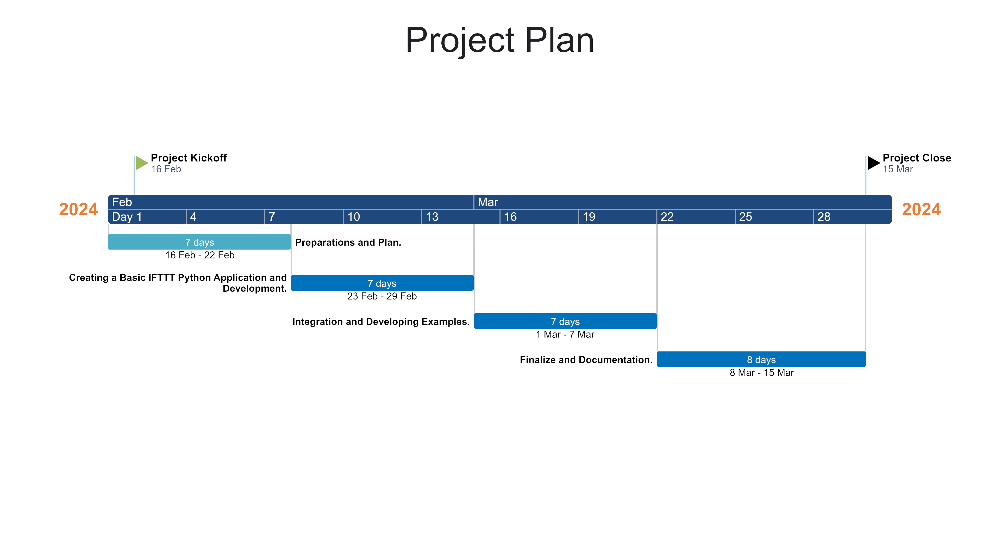

# Embedded-MicroPython
- [Embedded-MicroPython](#embedded-micropython)
- [Project Plan](#project-plan)
  - [Week 1 - Preperations and Plan](#week-1---preperations-and-plan)
  - [Week 2 - Transition from IFTTT to Make.com Automation Platform](#week-2---transition-from-ifttt-to-makecom-automation-platform)
  - [Week 3 - Integration and Developing Examples on Make.com](#week-3---integration-and-developing-examples-on-makecom)
  - [Week 4 - Finalize and Documentation](#week-4---finalize-and-documentation)
  - [Gantt Chart](#gantt-chart)

# Project Plan 

## Week 1 - Preperations and Plan

- [x] Conduct a thorough research on the **IFTTT** platform.
- [x] Set up the necessary environments and tools for **Sixfab Raspberry Pi Pico W**.
- [x] Create a gantt chart and project plan for the project.
- [x] Research to understand the basics of a Python application to interact with **IFTTT**. 
- [x] Research sections such as **Conventional Commit, PEP-8 Style, Docstring, Gitflow.**
- [x] To examine the existing codes in the application and sample code writing and to learn the **state manager** structure.

## Week 2 - Transition from IFTTT to Make.com Automation Platform

- [x] Realisation that the Webhook service on the IFTTT platform is paid.
- [x] Finding Make.com (formerly integromat) automation platform that provides free Webhook service. 
- [x] Developing a demo project for automation with POSTMAN via Make.com.

## Week 3 - Integration and Developing Examples on Make.com

- [ ] Writing advanced code to integrate the Sixfab Raspberry Pi Pico W with Make.com.
- [ ] Sending direct commands to test the integration of Make.com applets and Python code.
- [ ] Auditing the workflows created as a result of Make.com triggering actions and checking whether they are working correctly.

## Week 4 - Finalize and Documentation

- [ ] Testing the final stages of the integration processes and making sure that the application is stable.
- [ ] Writing the project documentation, including detailed instructions on how to use the tools and example scenarios.
- [ ] To prepare a guide on how the project and code samples are created and how the integration is done.
- [ ] Review the final report and documentation and publish to Github. 

## Gantt Chart 

