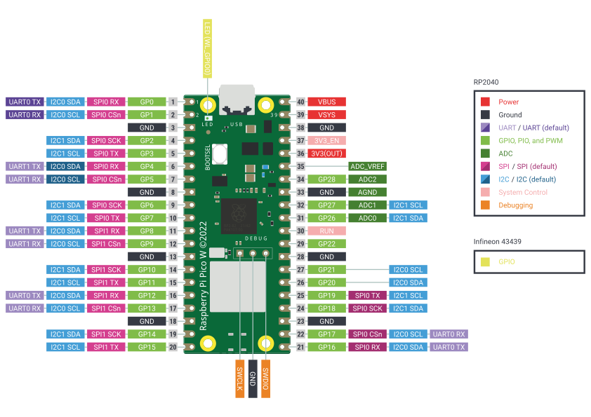

## Week1 

1. [MicroPython](#micropython)
2. [Raspberry Pi Pico W](#raspberry-pi-pico-w)
3. [Sixfab Pico LTE](#sixfab-pico-lte)
4. [References](#references)

### MicroPython

* I first started my research by learning what MicroPython is. MicroPython is a software implementation of a programming language that is largely compatible with Python 3, written in C and optimised to run on a microcontroller.
* I have learnt [through a video](https://youtu.be/DFp_T-H3eRc?si=Xga_QpDc4CODj4_-) the obvious differences between MicroPython and the C language, which are mentioned below.
    * Setup() and Loop() functions are not available.
    * No **";"** for line termination. 
    * No **"{ }"** are used for code blocks, conditions or loops.
    * Code is executed from top to bottom. 
    * Runtime error checking instead of compile time. 

### Raspberry Pi Pico W 

* Raspberry Pi Pico W is a low-cost but flexible RP2040 development platform officially designed by Raspberry Pi. It is a wireless upgrade version of Raspberry Pi Pico.

* For comparison, I have learnt the significant differences between the Arduino Nano, which is a similar product on the market, and these are mentioned below. 
    * Raspberry Pico W **(133 MHz)** is considerably faster than Arduino Nano **(16MHz)**.  
    * Raspberry Pico W has 32-bit ARM architecture, while Arduino Nano has 8-bit Modified Harvard architecture. 
    * Raspberry Pico W has 2MB memory, while Arduino Nano has 32KB memory. 
    * While Raspberry Pico W has 26 Digital I/O pins, 16 PWM pins and 3 Analogue Input pins, Arduino Nano has 22 Digital I/O pins, 6 PWM pins and 8 Analogue Input pins. 
        

### Sixfab Pico LTE 

* Sixfab Pico LTE is an IoT development board designed by Sixfab, Inc. It combines the power of Raspberry Pi Pico W and the Quectel BG95-M3 modem, providing a comprehensive platform for IoT evaluation and development purposes. With its integrated components and feature-rich design, Sixfab Pico LTE enables users to explore and experiment with Pico W and LTE technologies.
    

### References 

* https://electrocredible.com/raspberry-pi-pico-vs-arduino-which-board-to-choose/
* https://docs.sixfab.com/docs/sixfab-pico-lte-introduction 

