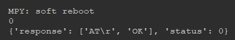
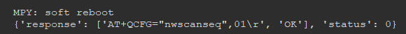
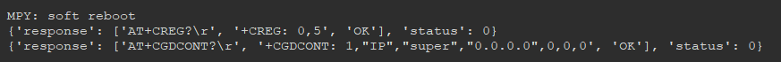
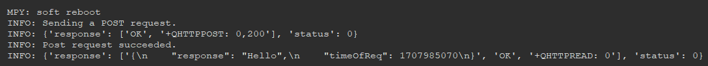
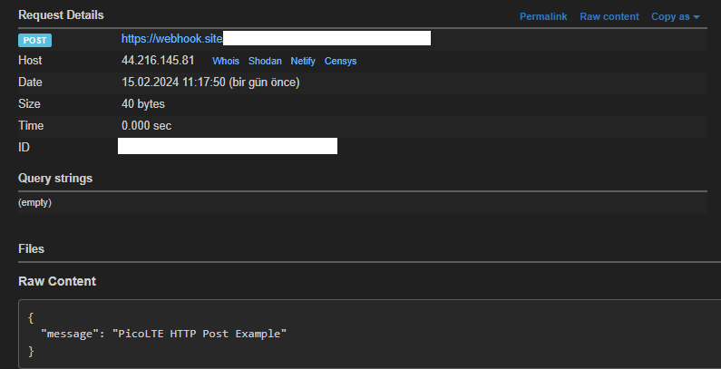
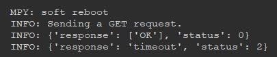
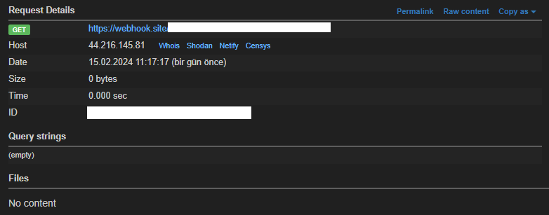
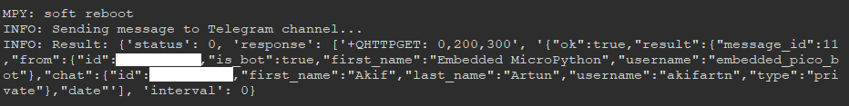

## Week 2

1. [Sixfab Pico LTE Setup](#sixfab-pico-lte-setup)
2. [Applications without Modem- Button, LED, NeoPixel LED ](#applications-without-modem--button-led-neopixel-led)
3. [Connection Check ](#connection-check)
4. [Improvement of Connection Time ](#improvement-of-connection-time)
5. [Network Connection Control](#network-connection-control)
6. [HTTP Requests to webhook.site](#http-requests-to-webhooksite)
7. [Sending Message to Telegram](#sending-message-to-telegram)
8. [Extras](#extras)

### Sixfab Pico LTE Setup 

* I connected the Sixfab Pico LTE development board to the computer with a usb cable while holding down the BOOTSEL button. 
* In Thonny IDE, I installed MicroPython into Raspberry Pico W by clicking where the Python version appears at the bottom right. 
* I downloaded [Sixfab Pico LTE SDK](https://github.com/sixfab/pico_lte_micropython-sdk) from Github. 
* I opened the folder with the downloaded folder in Thonny IDE and sent this folder to Raspberry Pico W using **"Upload to /"**. This way I completed the installation.

### Applications without Modem- Button, LED, NeoPixel LED 

* Firstly, I tested the functionality of the LEDs and buttons on the development board.
* I started my tests with **blink_led.py**, one of the sample codes in the Pico LTE SDK. The led on the board started blinking and I successfully performed my test.  
* To test the button functionality, I ran the **button_controlled_led_toggle.py** file. This code, which was written to work every time I pressed the button, worked successfully. 
* Finally, I ran **neopixel_led_colour_cycling.py** to test the rgd led on the board. It worked successfully. 

### Connection Check 

* To manage AT communication with the modem, I first created an example from the ATCom class using the `atcom = ATCom() ` command. 
* I used the `base = Base(atcom)` command to create the Base class, which is the class containing the basic functions of the PicoLTE module. 
* First of all, I realised that the modem was not switched on because the status light was not on and I switched on the modem by executing the `base.power_on()` command. The status light turned blue. 
* I checked whether the modem was switched on by using the `response = base.power_status()` command. 
* After switching on the modem, I ran the `base.check_communication()` command, which checks the connection by sending an AT command to check the connection. 

    ```

    from pico_lte.utils.atcom import ATCom 
    from pico_lte.modules.base import Base
    
    # Instantiate the ATCom object 
    atcom = ATCom() 
    
    # Instantiate the Base object 
    base = Base(atcom)

    # base.power_on()
    response = base.power_status()
    print(response)
    response = base.check_communication()
    print(response)

    ```
* OUTPUTS. 

    

### Improvement of Connection Time 

* The modem automatically searches for possibilities for connection. GSM connection is supported in our country. I reduced the connection speed by setting the connection via GSM instead of automatic search.

    

### Network Connection Control

* Before sending HTTP requests, I checked the network requirements of the modem. 
* First, I ran `check_network_registration()` to verify that the modem is registered on the roaming network with the output **+CREG: 0.5**. 
* Additionally, I used the `check_apn()` command to get the **apn** value and got **{'response': ['AT+CGDCONT?\r', '+CGDCONT: 1, "IP", "super", "0.0.0.0.0",0,0,0,0', 'OK'], 'status': 0}**. 
* OUTPUTS.

    

### HTTP Requests to webhook.site

* Firstly, I implemented the HTTP POST request. 
* In order to provide HTTP requests, I first edited a file named **config.json**.
    ```
        {
            "https":{
                "server": "https://webhook.site/WEBHOOK_URL",
                "username": "",
                "password": ""
            }
        }
    ```
* I tested the connection by running the **post.py** file, which is one of the sample codes in the Pico LTE SDK, after examining it. It was successful. 
     
     
* After the POST request was successful, I switched to the GET request and tested the connection by running the **get.py** file, which is one of the sample codes for this, after reviewing it. It was successful. 
     
    

### Sending Message to Telegram

* In order to send information over the modem in Telegram, I first set up a Telegram bot. I got the token information of this bot I set up. 
* With the token I obtained, I opened the "https://api.telegram.org/botYOUR_ACCESS_TOKEN/getUpdates" site and got the **chat-id** value. 
* I added **chat-id** and **token** information to the **config.json** file as I do in HTTP requests.
    ```
        {
            "telegram": {
                "token": "YOUR_BOT_TOKEN_ID",
                "chat_id": "YOUR_GROUP_CHAT_ID"
            }
        }
    ```
* I ran **send_message.py** in the Pico LTE SDK to send a message to the telegram bot. It successfully sent the message.
    
    


### Extras 

* When I examined the codes in the Pico LTE SDK github, I noticed that there is a **status** value in the outputs given after the operation. I saw that this value is in the **status.py** file in the **utils** folder. These status values are shown below.
    ```
        class Status:
            SUCCESS = 0
            ERROR = 1
            TIMEOUT = 2
            ONGOING = 3
            UNKNOWN = 99
    ```
* I have learnt that **debug.py** file in **utils** folder in Pico LTE SDK is necessary for information outputs after the operations performed. 
* I have learnt that **manager.py** file in **utils** folder in Pico LTE SDK is one of the important files. The **Step** class here works by taking certain parameters and by determining the next step to run within itself, successive codes can be run within the control mechanism.
