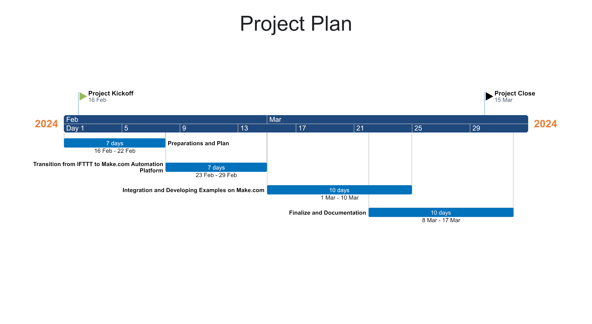

## Week 3 
- [Week 3](#week-3)
  - [Examination of Developer Guideline File](#examination-of-developer-guideline-file)
  - [Examination of IFTTT Automation Application and Application Areas](#examination-of-ifttt-automation-application-and-application-areas)
  - [Project Plan and Gantt Chartt](#project-plan-and-gantt-chartt)

### Examination of Developer Guideline File

* I learnt what **PEP8** rules are and their details through [this site](https://realpython.com/python-pep8/#naming-conventions) 
     
* To learn the **pylint** working logic, I examined and updated my errors according to PEP8 rules in the library I wrote for communication with AT commands. 
* Using black formatter, I learnt how to automatically update the code according to PEP8 rules without using pylint. 
* While doing research on Conventional Commit messages, I saw how necessary it is and how the readability of commits increases. 
* The structure of Conventional Commit is given below. type could be fix, feat, BREAKING CHANGE, chore, docs, refactor, test etc.
  ```
    <type>[optional scope]: <description>

    [optional body]

    [optional footer(s)] 
  ```
* I created a commit according to this format and published it. ("style: Reformat files according to PEP8 guidelines") 
* I learnt the rules of this format by examining the numpy format to be used for docstring. 
* I understood the Gitflow architecture in detail through [this video](https://www.youtube.com/watch?v=1SXpE08hvGs). In Gitflow architecture, the master branch is the most important branch and developments can be made in the dev branch first and then transferred to the master branch. 
     
* I opened a branch according to gitflow architecture in the github repository, which is the project development environment.

### Examination of IFTTT Automation Application and Application Areas

* IFTTT Automation application is an application created to save time and facilitate workflows in daily life. 
* When I looked at the projects of this application that can be created with Raspberry Pi Pico W, I came across the following projects. 
  * **Time Based Trigger:**
   - Sending a signal to IFTTT at a certain time every day (for example, IFTTT trigger to send the weather report of the day by e-mail every morning at 08:00).
  * **State Change Detection:**
   - Calling a webhook if the value of a variable exceeds a certain threshold (for example, sending a notification if the value of a stock simulated in the script exceeds a certain price point).
  * **IFTTT Triggering in Response to a Specific Event:**
   - Sending a notification mail via IFTTT as a result of performing an in-app action (for example, a user pressing a button).
* With IFTTT, projects can be created in a wide range of areas such as this, but in order for this application not to use any sensors and not to limit the user, I aim to send data to this event after the event determined by the user. If I give a basic example; If the user wants to send an e-mail from a code, after selecting the mailing event via IFTTT and specifying this name and token in the config.json file, the user will be able to send the data he wants to send from the code as an e-mail to himself. 

### Project Plan and Gantt Chartt

* As a result of the researches I have done for the development of this project, I predicted that 4 weeks would be enough. 
* I planned the first week of this project as preparations and planning, i.e. obtaining detailed information about the project and learning the requirements. 
* The second week,
  * Writing a sample code to create a basic Python application using IFTTT's Webhook service. 
  * Create endpoints to listen and react to requests from IFTTT. 
  * Defining and coding basic functions and methods that can work with IFTTT.
* The third week,
  * Writing advanced code to integrate the Sixfab Raspberry Pi Pico W with IFTTT.
  * Sending direct commands to test the integration of IFTTT applets and Python code.
  * Auditing the workflows created as a result of IFTTT triggering actions and checking whether they are working correctly.
* The last week was dedicated to final testing and documentation. 
* You can find the Gantt Chart below.
    

