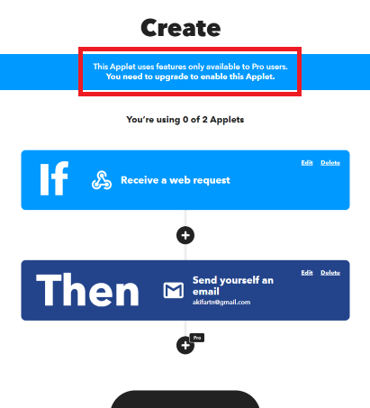
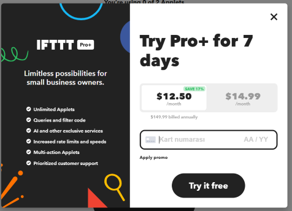
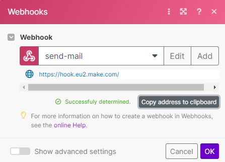
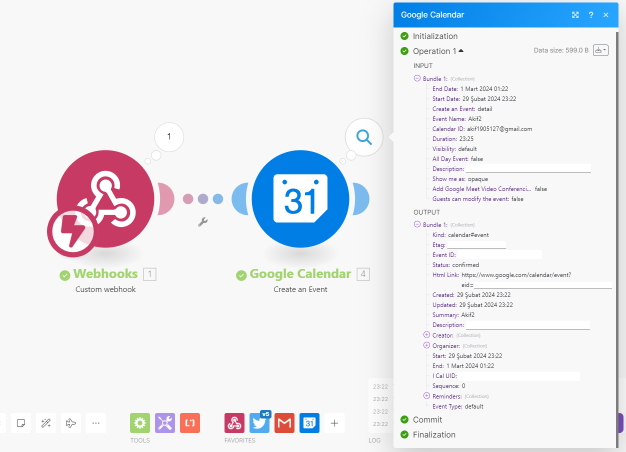

## Week 4 

- [Week 4](#week-4)
  - [IFTTT Webhook Protocol Usage Problem](#ifttt-webhook-protocol-usage-problem)
  - [MAKE Automation (formerly Integromat)](#make-automation-formerly-integromat)
  - [References](#references)

### IFTTT Webhook Protocol Usage Problem

* While starting to make an example with IFTTT, I first started to set the configuration from within the application. In the first example, I planned to send an information e-mail to the user's e-mail after the HTTP POST request sent by raspberry pi pico w. 
* In order to do this automation, I first created a new applet in IFTTT (If This Then That). 
* I selected a trigger in the applet and selected the Webhook service for the automation I will do. 
* After adding all the necessary services for the applet, at the last stage **"This Applet uses features only available to Pro users. You need to upgrade to enable this Applet. "** error. I understood that the reason for this is that the Webhook service is only for **PRO** users as of 15.02.2024. Therefore, I could not make progress via IFTTT. 
    * 
    * 

### MAKE Automation (formerly Integromat)

* IFTTT application is impractical because the customer needs to access the Webhook service free of charge. As a result of my research, I think it would be more appropriate to use [Make Automation](https://www.help.make.com/en/help/tools/webhooks) application instead of IFTTT.  
* I implemented a quick example via postman to learn the working logic of the Make automation application and to test the webhook service. 
* First of all, after logging in to [make.com](https://www.make.com/en) and becoming a member, I obtained the webhook link to create my first example. 
    
* My main goal in the example was to create a 1-hour event with the name specified by the user in the Google Calendar application after receiving a POST request to this link.
* After the automation system I created, I sent a POST request to the webhook link I obtained using POSTMAN and successfully created an event with the name I specified. 
    
* I did not create a very detailed automation system because I wanted to test the functionality of the Webhook service in a new automation application and because it is currently at the decision stage. However, in my research, I realised that it allows the customer to automate with almost any application he wants without restriction. 

### References

* https://www.youtube.com/watch?v=Q4906UIhHoU 
* https://www.help.make.com/en/help/tools/webhooks 
* https://www.reddit.com/r/ifttt/comments/1as8emd/no_more_free_webhook_applets/ 
