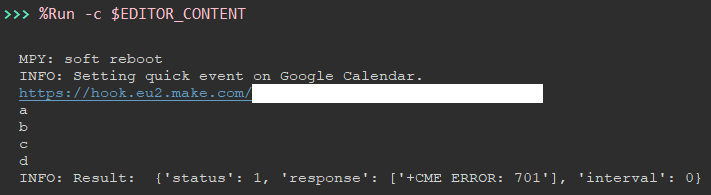

## Week5 

- [Week5](#week5)
  - [Coding of make\_automation.py Application](#coding-of-make_automationpy-application)
  - [Implementation of Sample Code](#implementation-of-sample-code)
  - [CME ERROR: 701](#cme-error-701)

### Coding of make_automation.py Application

* First of all, I started the installation of make_automation.py with the integration of the necessary libraries.
* Then I built the StateManager structure, which is the skeleton of the code. 
* Before starting the StateManager structure, I created the requirements for the architecture. They are;
  * I integrated the code required to get the link in the "url" parameter under the "make_automation" heading in the config.json file. 
    * `url = get_parameter(["make_automation", "url"])`
  * Secondly, because of the "CME 701" error, which I will talk about later, I added the plugin I created while trying different ways. This code is used to convert the data to be sent to json structure. However, I still haven't solved the error.
    *   ```
        payload_json = {"text": message}
        payload = json.dumps(payload_json)
        ```
* Steps I created in the StateManager structure are given below. 
    * register_network - It will register to the network.
    * prepare_pdp - for getting ready pdp context.
    * set_server_url - Set the url to send HTTP request. The url is entered as a function parameter. 
    * set_content_type (added later) - selects the format of the data to be sent.
    * post_request - the part where the post request is processed. 
    * read_response - the part where the response is read. 
* How the steps are constructed is shown below.
    ```
        
        step_register_network = Step(
            name="register_network",
            function=self.network.register_network,
            success="prepare_pdp",
            fail="failure",
            retry=3,
        )

        step_prepare_pdp = Step(
            name="prepare_pdp",
            function=self.network.get_pdp_ready,
            success="set_server_url",
            fail="failure",
        )

        step_set_server_url = Step(
            name="set_server_url",
            function=self.http.set_server_url,
            success="set_content_type",
            fail="failure",
            function_params={"url": url},
            interval=2,
        )

        step_set_content_type = Step(
            name="set_content_type",
            function=self.http.set_content_type,
            success="post_request",
            fail="failure",
            function_params={"content_type": 4},
        )

        step_post_request = Step(
            name="post_request",
            function=self.http.post,
            success="read_response",
            fail="failure",
            function_params={"data": payload},
            cachable=True,
            interval=3,
        )

        step_read_response = Step(
            name="read_response",
            function=self.http.read_response,
            success="success",
            fail="failure",
            function_params={
                "desired_response": ["200"],
                "fault_response":["404"]
            },
        )

    ```

### Implementation of Sample Code

* After I finished writing the application, I started the testing phase by creating sample code. 
* First of all, I examined the sample codes written before. 
* One of the common points of these sample codes was that the PicoLTE class must be called first to call the application we produced. 
* I realized that the PicoLTE class is in the core.py file and examined the file. 
* I realized that there is a section in the core.py file where the constructors of previously written modules and applications are called and I added the necessary steps for the make_autoamtion.py application. These lines are given below.
    ```
    from pico_lte.apps.make_automation import MakeAutomation
	
    self.make_automation = MakeAutomation(self.base, self.network, self.http)
    ```
* After updating the PicoLTE class, I created the code below to run my sample code.
    ```
    from pico_lte.core import PicoLTE
    from pico_lte.common import debug

    picoLTE = PicoLTE()

    debug.info("Setting quick event on Google Calendar.")
    result = picoLTE.make_automation.send_data("Test Data")
    debug.info("Result: ", result)

    ```
* When trying the example I get `" INFO: Result: {'status': 1, 'response': ['+CME ERROR: 701'], 'interval': 0} "` error is explained in the next section.

### CME ERROR: 701 

* In the test example I made to try the application I developed, `INFO: Result: {'status': 1, 'response': ['+CME ERROR: 701'], 'interval': 0}` error and I haven't solved it yet. 
* In the first version of the code, I was sending the data as a string and I didn't run the **"step_set_content_type "** step. 
* After getting the error, while examining other examples, I realized that in the slack application example, when using the post method in the post method, it was converted to json and sent in that way, and I set the content type to 4 in the **"step_set_content_type "** step. However, I am still getting the error. 
* In order to understand where the error is, I added outputs starting from the letter a to the letter e in each step I run. 
* With this simple error catching method, I realized that the problem was in the http.post method. 
  * print("a") -> on the register_network step (network class) 
  * print("b") -> if set_server_url ran successfully (http class)
  * print("c") -> on the set_content_type step (http class)
  * print("d") -> At the moment of execution of the AT+QHTTPPOST command (http class)
  * print("e") -> if the AT+QHTTPPOST command ran successfully (http class)
* Below is the output I received and I have not been able to resolve the error yet.
    
