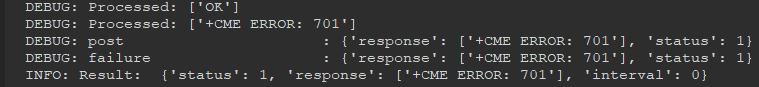

## Week 6

### Problem of CME 701

* This week, I started by trying different methods that can be tried to solve the CME 701 error. 
* Firstly, I tried to connect by changing the apn value from "super" to "de1.super" but I still get the error. 
* Also, according to the suggestion from last week's meeting, I adjusted the ssl configuration settings but the error still persists. 
* I had a meeting with my team mate who got the same error with me and we analysed our codes but we couldn't see any deficiency. 

    
