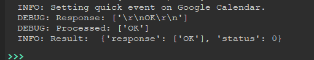
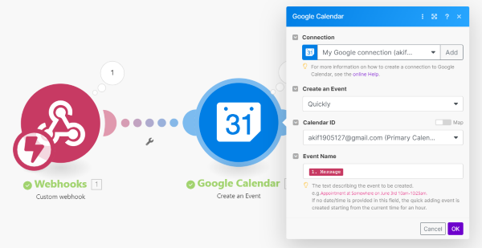
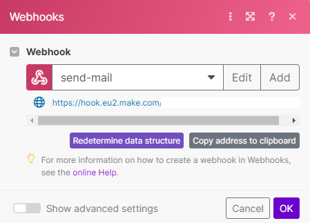
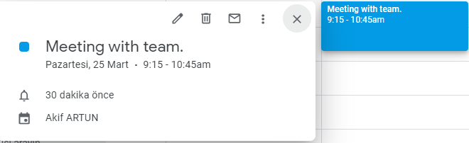
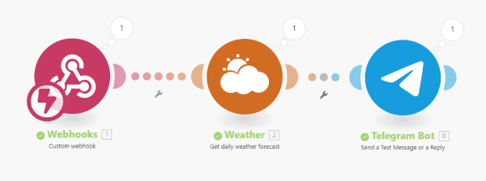
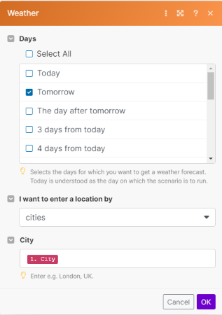
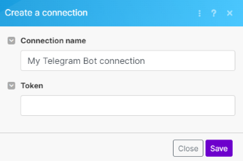
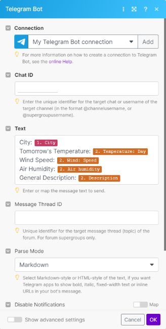
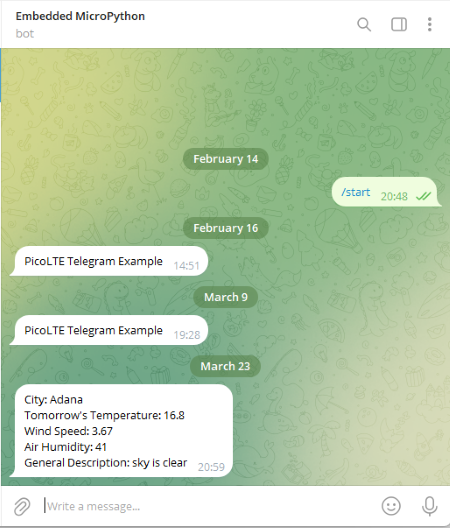

## Week 7 

- [Week 7](#week-7)
  - [Fixing the CME: 701 Error](#fixing-the-cme-701-error)
  - [First Demo - Create Quick Event on Google Calendar via MakeAutomation](#first-demo---create-quick-event-on-google-calendar-via-makeautomation)
  - [First Automation System - Create Event on Google Calendar via MakeAutomation](#first-automation-system---create-event-on-google-calendar-via-makeautomation)
  - [Second Automation System - Get Weather to Telegram via MakeAutomation](#second-automation-system---get-weather-to-telegram-via-makeautomation)

### Fixing the CME: 701 Error

* Thanks to the suggestion of my technical advisor, I solved the CME:701 error I received in the past weeks. 
* I eliminated this error by running **AT+QSSLCFG="sni",1,1**. 

    
* Our technical consultant added a function called **set_sni** to **ssl.py** in **modules** folder to be suitable for the general code architecture of the SDK. In this way, the **set_sni** function has been brought to a level where it can be added as a step.  
* To add the **set_sni** function as a step, I first added the **ssl** module in the constructor. I also updated the line `self.make_automation = MakeAutomation(self.base, self.network, self.http, self.ssl)` in **core.py**. 

    ```
         def __init__(self, base, network, http, ssl):
            """Constructor of the class.

            Parameters
            ----------
            base : Base
                PicoLTE Base class
            network : Network
                PicoLTE Network class
            http : HTTP
                PicoLTE HTTP class
            ssl : SSL
                PicoLTE SSL class
            """
            self.base = base
            self.network = network
            self.http = http
            self.ssl = ssl
    ```
* After updating the constructor, the functions in the **ssl.py** file are now accessible. In this way, I added **set_sni** function as a step between **prapare_pdp** and **set_server_url** steps. 
    ```
        step_set_sni = Step(
            name="set_sni",
            function=self.ssl.set_sni,
            success="set_server_url",
            fail="failure",
            function_params={"ssl_context_id": 1, "sni": 1}
        )
    ```

### First Demo - Create Quick Event on Google Calendar via MakeAutomation 

* With the CME:701 error resolved, there is no longer any obstacle for the application I developed to work. To test this, I created a small demo automation system on Make.com. 
* The general architecture of the demo automation system is shown in the picture below.

  
* I added the Webhook url obtained from the Webhooks module to the config.json file in PICO LTE in the following format. 

  ```
  "make_automation": {
       "url": "https://hook.eu2.make.com/UNIQUE_ID"
   }
  ```

  
* After the process in the Webhook module is finished, I first connected my Google Calendar account with MakeAutomation to create an event on Google Calendar. 
* First of all, I selected **Quickly** under **Create an Event**. Quickly creates an event starting from the current time and lasting 1 hour according to the incoming data. 
* I learned that the best way to access the data on the Make site is JSON data, so I set the data to `payload_json = {"message": "Hello from PICO LTE."}`. 
* Since I want to name the event according to this data I sent, I need to map it. 
* In order to do mapping, I first ran the code I wrote as an example and sent the POST request to the specified webhook link. In this way, I mapped the data coming from the webhook module. In the picture above, **"1.Message "** under the **"Event Name "** heading refers to this. 
* After making all the settings, I started to test the system I created. For this, I press the **Run Once** button at the bottom left and put the system in listening mode for the request. 
* I successfully ran the sample code in PICO LTE and it created a 1 hour event for me with the name I specified. 

    
* Since this is the first demo, I thought of developing more customer-friendly examples and decided to make an automation system that creates an event at the time the user wants. I will be explaining this in the next title. 


### First Automation System - Create Event on Google Calendar via MakeAutomation

* After running the first demo successfully, I realized that the system works successfully and I wanted to create more user-friendly examples. 
* The automation system aims to create an event on Google Calendar with the name, date and time specified by the user. 
* The general architecture of this automation system is shown in the picture below. 

    
* First, I added the link I obtained from the Webhook module to the config.json file in the appropriate format. 
* Since I had already connected my Google Calendar account before, I didn't need to connect it again. 
* This time, unlike the previous example, I set the section under the **Create an Event** heading as **In Detail**. Because I want the user to enter variables such as the day and duration of the event. 
* In each example, we only need to run the webhook module once. Because in this way we can learn which data will come through webhook. 
* Before running the webhook module, I collected the variables I will send through the sample code in JSON format as below and ran the code to learn the variable structures on the make.com side. 
    ```
    payload_json = {"Name": "Meeting with team.",
                    "Start_Date": "25.03.2024 09:15", 
                    "Duration": "01:30"}
    ```
* The variable types in the data received by the webhook are indicated with a purple background. It is shown in the picture above. 
* I added the **"Name "**, **"Start_Date "** and **"Duration "** variables that I sent through the sample code to the **"Event Name "**, **"Start Date "**, **"Duration "** fields respectively in the google calendar modol. 
* In this way, I completed the system. 
* To run this system, I clicked the **Run Once** button at the bottom left and ran the sample code I created over PICO LTE. 
* The code ran successfully and created an event on Google Calendar with the features I specified. 

    

### Second Automation System - Get Weather to Telegram via MakeAutomation

* As a second example, as a result of various researches, I planned to make an automation system that sends the weather forecast of the city entered by the user via Telegram. 
* Normally, I wanted to inform the user via mail instead of telegram, but I did not want to bother the user with too much detail because the mail sending system of the make.com site is too detailed. 
* The general architecture of this automation system is shown in the picture below. 

    
* As in every project, I first ran the webhook module alone and sent the data with the code. In this way, the data I will send is displayed on the make.com site. 
* In the weather module, I entered the city information entered by the user here and set it to send the weather forecast for that city tomorrow.

    
* In the Telegram module, I first entered the **token** value of the telegram bot I created before. 

    
* After entering the token value, I started to make the settings of the telegram module. I filled the **chat id** value of the bot that I previously used in the telegram example in the SDK into the relevant field and the rest of the adjustments are shown in the picture below. 

    
* I tested the automation system with `payload_json = {"City": "Adana"}` data and it worked successfully. 

    
