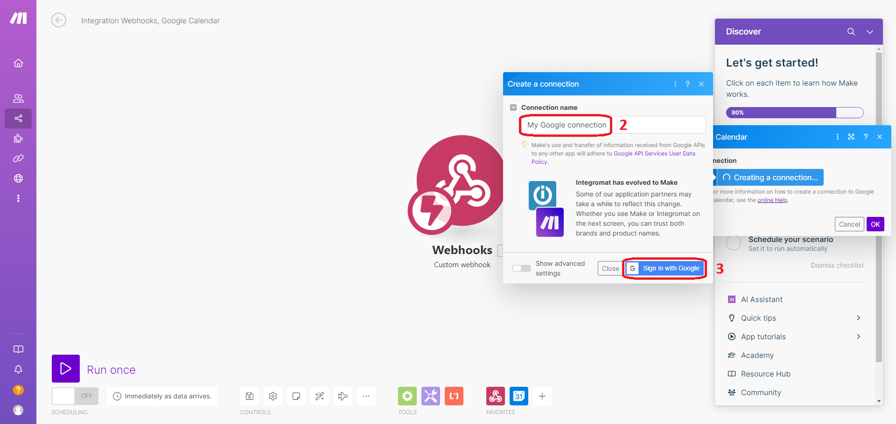

# Create Automations on Make.com

Make.com is a powerful integration platform that lets you connect your favorite apps and services to automate repetitive tasks. Build custom workflows to streamline your work, boost productivity, and free yourself from manual busywork. Make.com integrates with thousands of popular tools, making it easy to automate tasks across your entire workflow.

Before starting this Pico LTE tutorial, the Pico LTE SDK installation and configuration steps must be completed. Below are the system requirements for this tutorial. If you haven't followed the SDK installation steps, please refer to the page below before proceeding with the tutorial. The details of these steps will not be covered in this tutorial.

## System Requirements

| Hardware Requirements | Software Requirements | 
| --------------------- | --------------------- |
| Sixfab Pico LTE       | Thonny IDE            |
| Micro USB Cable       |                       | 

If you have completed all the requirements, you are ready to create automations on Make.com with the Pico LTE device.

Let's get started!

## Preparing Coding Environment

1. Download the [Pico LTE SDK repository](https://github.com/sixfab/pico_lte_micropython-sdk) to your local machine. If you have already downloaded it, skip this step. 
2. Open script **"examples → make_automation → create_event.py / get_weather.py"** from the repository via Thonny IDE.
3. If you haven't, create a ``config.json`` file in the root directory of Pico LTE device.

## Create event in Google Calendar using Make.com

1. Login to Make.com 

    Login to your Make.com account from [the login page](https://www.make.com/en/login), if you do not have an account, create a new account from the [registration page](https://www.make.com/en/register?). You can answer the questions during registration as you wish.

2. Create a New Scenario 
   
   Press on the **"Create a new scenario "** button.

   

3. Prepare First Module (Webhooks)

    Press the plus bubble in the centre of the page. Enter "Webhooks" in the search field. Then select the **Webhooks** module.

    

    Select **"Custom webhook "** under the Triggers heading.

    

    Press **"Create a webhook"** button and name it. 

    
    

    The picture below shows that the webhook module is in listening mode to access the names of the variables you send. In this case, you need to run **"examples → make_automation → create_event.py "** once from the repository via Thonny IDE. Keep the webhook url that appears here for running the code. To run the code, go to [**Test the code example**](#test-the-code-example) heading and after running it back continue from here. 

    

    After the code runs successfully, **"Succesfully determined"** appears. And you can continue to add the next module. 

    

4. Prepare Second Module (Google Calendar)

    Press the small plus bubble next to the webhook module. Enter "Google Calendar" in the search field. Then select the **Google Calendar** module.

    
    

    Select **"Create an Event "** under the Events heading.

    

    Press **"Create a connection"** button and connect your Google Calendar account. 

    

    After pressed **"Create a connection** button, name the connection and press **"Sign in with Google"** button. 

    

    Fields 1 and 2 should be selected as shown in the figure. After clicking on the fields numbered 4, 5 and 6, the relevant information should be entered from the sub-menu (indicated by number 3). If you do not see any variable in the menu shown with 3, please refer to [**Troubleshooting**](#troubleshooting).

    

## Test the Code Example 

1. Copy the following code block into the config.json file and enter your webhook url.
   
   ```
   {
    "make_automation":{
            "url": "[INCOMING_WEBHOOK_URL]",
        }
   } 
   ```
2. Open script "examples → google_sheets → create_event.py" from the repository via Thonny IDE. 
3. Set the Name, Start_Date and Duration values you want to create an event. Run the **"create_event.py"**. 

    
4. The output you get in the code should look like this:

    ```
    MPY: soft reboot
    INFO: Setting event on Google Calendar.
    INFO: Result:  {'status': 0, 'response': ['Accepted', 'OK', '+QHTTPREAD: 0'], 'interval': 0}
    ```
5. Now, go to your Internet browser and open the Google Calendar. You will see that it creates an event at the specified time.

    

6. If you want to see the progress of the automation system on the make.com site, firstly, put the system into listening mode by pressing the **"Run once "** button at the bottom left.

    

7. After the system is in listening mode, you can run the **create_event.py** file. After running successfully, it looks like the picture below.

    

8. Lastly, to keep the developed automation system continuously active, press the button marked with 1 in the lower left corner. 

    

## Troubleshooting

1. If you can't see the variables from the Webhooks module (background coloured in red) while filling in the fields in the **second module (Google Calendar)**, click on the **"Webhooks "** module and click on the **"Redeterimine data structure "** button and then run **create_event.py** as shown below. After the code runs successfully, **"Succesfully determined"** appears. After saving the scenario and refreshing the page, you can now see your variables in the relevant fields. 

    
